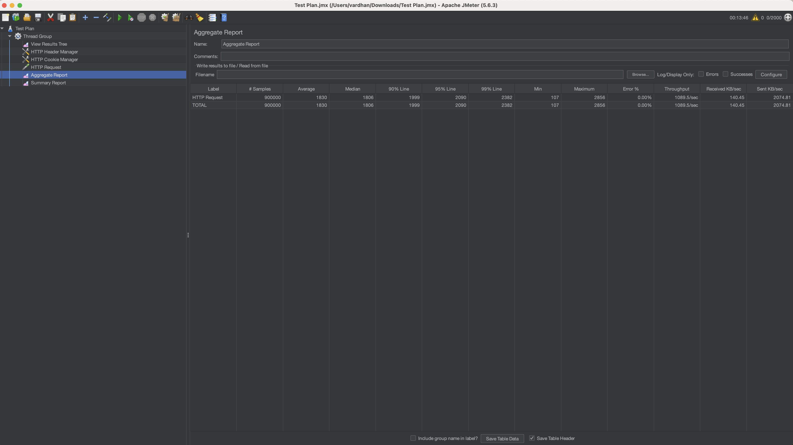
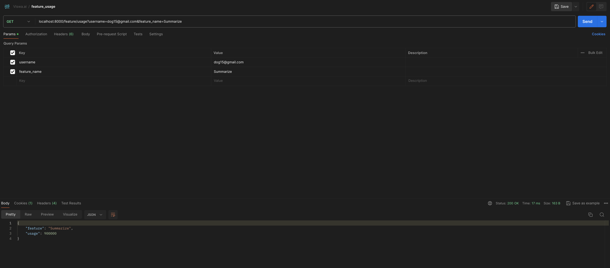
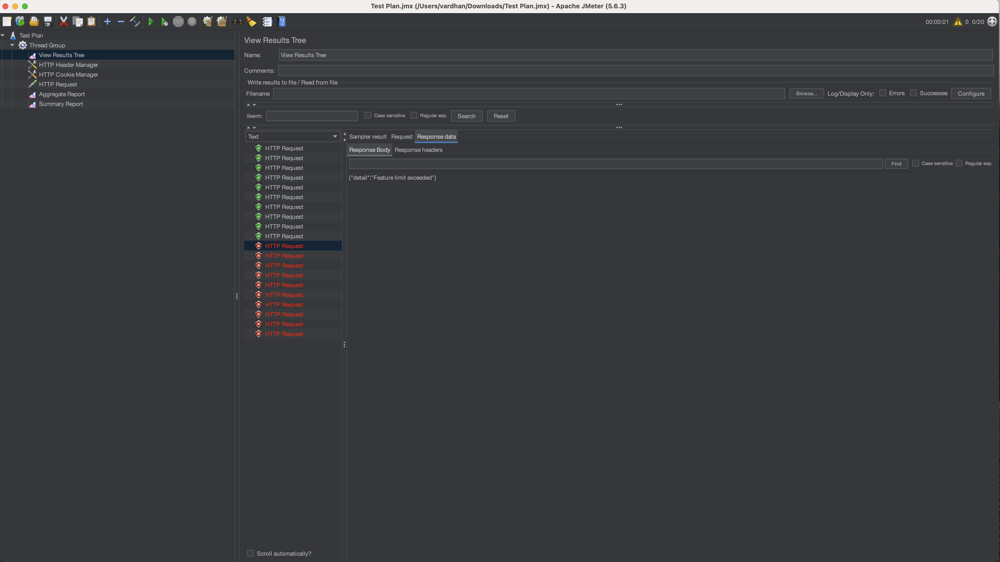
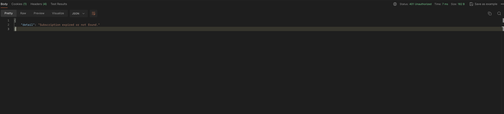

# Description
This is a basic text summarizer system written in python using fastapi. The purpose of the system is to showcase rudimentary feature tracking, enforcing susbcription validation, and throttling the usage when feature limits are exceeded.

# Setup

- This project utilizes pipenv for python virtual environment and dependency tracking. So we first need to install pipenv, you can find the instructions [here](https://pipenv.pypa.io/en/latest/installation.html).

- In order to track features and cache validation for users we use redis. Follow this [link](https://redis.io/docs/latest/operate/oss_and_stack/install/) to setup redis locally and start the service.

- After installing pipenv instatiate the virtual environment using the following command:
    ```
    pipenv shell
    ```
- Install dependencies with the following command:
    ```
    pipenv install
    ```
- To run the application we use the following command:
    ```
    uvicorn main:app --host 0.0.0.0 --port 8000
    ```

# Testing

To evaluate the performance of our feature tracking service, I simulated the summarization service output as a static value for simplicity. I used JMeter to conduct the stress tests. You can replicate these tests using the provided [TestPlan.jmx](/TestPlan.jmx) file. **Note:** Ensure you obtain a session_token by logging in as a user and update this token inside the `HTTP Cookie Manager` config file in JMeter.

## Throughput Testing

With the feature usage limit set to 1 million, the system successfully handled 900,000 requests with a 0% error rate within 13 minutes.



We have also exposed an endpoint at `/feature/usage` to check the usage of the feature.



As we can see above the feature usage is accurately tracked.

## Subscription Feature Limit Enforcement

For the next test, we set the feature usage limit for the "Summarize" feature to 10 and ran 20 threads. This setup led to 50% error rates after the first 10 successful requests as expected due to the limit enforcement. The results are depicted in the following graph:



## Subscription Expiry Enforcement

We further tested the system by setting the subscription expiry to a short duration like 2 minutes from user account creation. This test helped verify that our service correctly enforces subscription expiration.




# Persistence

By using append only file(AOF) setting we are recording the diff of redis queries efficiently allowing it to persist data and rebuild even after restart or failure.


